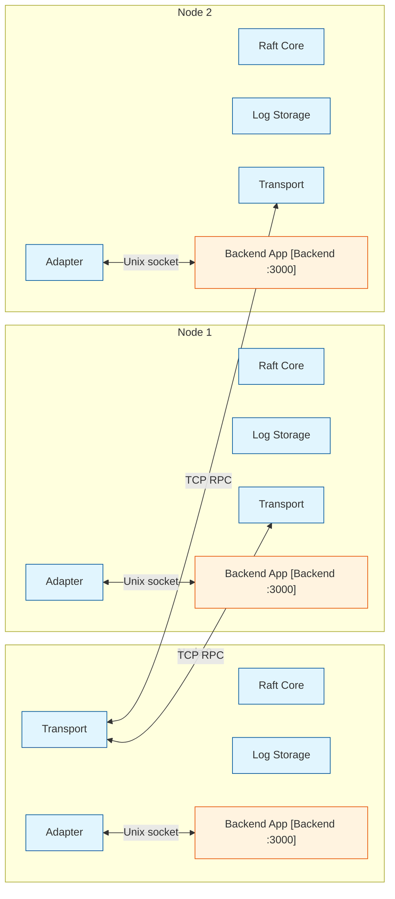

# Raft Proxy - Request Lifecycle

Legend: [Raft Proxy] = raft-proxy process | [Backend :3000] = separate backend process
Arrows between different-colored participants = protobuf/capnproto over Unix socket

## Process Ownership Per Node

Each node runs **two processes** on the same host. Components within a process communicate via function calls (zero IPC overhead).



| Component | Process | Communication with other components |
|---|---|---|
| **Adapter** | `raft-proxy` | Function calls to Raft Core; protobuf/capnproto over Unix socket to Backend |
| **Raft Core** | `raft-proxy` | Function calls to Log Storage, Transport |
| **Log Storage** | `raft-proxy` | File I/O (same process) |
| **Transport** | `raft-proxy` | TCP sockets to peer nodes' Transport |
| **Backend** | Separate process | Protobuf/capnproto over Unix socket with raft-proxy |

**Key point:** Adapter, Raft Core, Log Storage, and Transport are all in the same Rust binary — they share `Arc`, channels, and memory. Only the Backend is a separate process. The "pluggable" adapter pattern compiles into this same binary via trait objects (`Box<dyn BackendAdapter>`).

**All-nodes-apply:** Every node (leader and followers) applies committed entries to its own local backend. All three backends maintain identical state. Failover is instant — the new leader's backend is already up-to-date.

## Write Request Flow

```mermaid
sequenceDiagram
    autonumber

    box Client Process
        participant C as Client
    end

    box Node 0 - Leader
        participant AD0 as Adapter [Raft Proxy]
        participant RC0 as Raft Core [Raft Proxy]
        participant LS0 as Log Storage [Raft Proxy]
        participant TL0 as Transport [Raft Proxy]
        participant BE0 as Backend App [Backend :3000]
    end

    box Node 1 - Follower
        participant TF1 as Transport [Raft Proxy]
        participant LF1 as Log Storage [Raft Proxy]
        participant RF1 as Raft Core [Raft Proxy]
        participant AD1 as Adapter [Raft Proxy]
        participant BE1 as Backend App [Backend :3000]
    end

    box Node 2 - Follower
        participant TF2 as Transport [Raft Proxy]
        participant LF2 as Log Storage [Raft Proxy]
        participant RF2 as Raft Core [Raft Proxy]
        participant AD2 as Adapter [Raft Proxy]
        participant BE2 as Backend App [Backend :3000]
    end

    Note over C,AD0: Extract & append to log (in-process calls)
    C->>AD0: POST /api/data {body}
    AD0->>RC0: append(LogEntry{index:42})
    RC0->>LS0: flush() + fsync
    LS0-->>RC0: OK

    Note over TL0,TF2: Replicate to followers (network RPCs, parallel)
    RC0->>TL0: replicate AppendEntries(entries:[42])
    TL0->>TF1: TCP: AppendEntries(prev:41, entries:[{idx:42}])
    TL0->>TF2: TCP: AppendEntries(prev:41, entries:[{idx:42}])

    TF1->>LF1: append + fsync
    LF1-->>TF1: OK
    TF2->>LF2: append + fsync
    LF2-->>TF2: OK

    Note over RF1,RF2: Followers commit and apply to their own backends
    TF1->>RF1: entry persisted, commit_index=42
    TF2->>RF2: entry persisted, commit_index=42

    RF1->>AD1: apply committed entry 42
    AD1->>BE1: Unix socket (cross-process)
    BE1-->>AD1: OK

    RF2->>AD2: apply committed entry 42
    AD2->>BE2: Unix socket (cross-process)
    BE2-->>AD2: OK

    Note over TL0,RC0: Leader receives majority ACKs, commits
    TF1->>TL0: TCP: AppendEntriesResponse{success:true}
    TF2->>TL0: TCP: AppendEntriesResponse{success:true}
    TL0->>RC0: 2/3 ACKs → commit_index=42

    Note over RC0,BE0: Leader applies to own backend too
    RC0->>AD0: apply committed entry 42
    AD0->>BE0: Unix socket (cross-process)
    BE0-->>AD0: OK {id:"42"}

    Note over AD0,C: Route response back to client
    AD0-->>C: HTTP 200 OK {id:"42"}

    Note over C,BE0: All 3 backends now have the entry applied

    classDef raft fill:#e1f5fe,stroke:#01579b;
    classDef backend fill:#fff3e0,stroke:#e65100;
    class AD0,RC0,LS0,TL0,TF1,LF1,RF1,AD1,TF2,LF2,RF2,AD2 raft;
    class BE0,BE1,BE2 backend;
```

## Read Request Flows

### Mode A: Stale Read (fast, no Raft involvement)

Any node — leader or follower — can serve stale reads directly from its local backend. No consensus, may return slightly stale data.

```mermaid
sequenceDiagram
    autonumber

    box Client Process
        participant C as Client
    end

    box Any Node - Leader or Follower
        participant AD as Adapter [Raft Proxy]
        participant BE as Backend App [Backend :3000]
    end

    Note over C,BE: Fast read - no consensus, may return stale data

    C->>AD: GET /api/data/42
    AD->>BE: Unix socket (cross-process)
    BE-->>AD: {id:"42", name:"..."}
    AD-->>C: HTTP 200 {id:"42", name:"..."}

    classDef raft fill:#e1f5fe,stroke:#01579b;
    classDef backend fill:#fff3e0,stroke:#e65100;
    class AD raft;
    class BE backend;
```

- **Latency:** ~0.1ms (Unix socket only, no network stack)
- **Consistency:** Eventually consistent — could return data from before a write that's in-flight but not yet applied locally
- **Use case:** Dashboard reads, search, non-critical queries

### Mode B: Linearizable Read (leader only, guaranteed fresh)

Linearizable reads must go to the leader. If a client hits a follower with a linearizable read, the proxy returns an HTTP redirect (307) to the leader — no internal forwarding.

```mermaid
sequenceDiagram
    autonumber

    box Client Process
        participant C as Client
    end

    box Leader Node
        participant AD2 as Adapter [Raft Proxy]
        participant RC2 as Raft Core [Raft Proxy]
        participant BE2 as Backend App [Backend :3000]
    end

    Note over C,AD2: Client sends linearizable read to leader

    C->>AD2: GET /api/data/42 (linearizable)
    AD2->>RC2: check leadership + commit_index

    Note over RC2: Leader confirms it's still leader (read index protocol)

    RC2->>RC2: current commit_index=42, still leader
    RC2->>AD2: all entries up to 42 applied locally
    AD2->>BE2: Unix socket (cross-process)
    BE2-->>AD2: {id:"42", name:"..."}

    Note over AD2,C: Response returned directly to client

    AD2-->>C: HTTP 200 {id:"42", name:"..."}

    classDef raft fill:#e1f5fe,stroke:#01579b;
    classDef backend fill:#fff3e0,stroke:#e65100;
    class AD2,RC2 raft;
    class BE2 backend;
```

- **Latency:** ~0.1ms (Unix socket) + leadership check overhead, typically <1ms on leader
- **Consistency:** Linearizable — guaranteed to see all previously committed writes
- **Use case:** Financial data, inventory checks, anything that can't tolerate stale reads

### Read Mode Selection

The adapter controls which path a read takes. The `BackendAdapter` trait is extended:

```rust
pub enum ReadPolicy {
    Stale,          // direct to local backend
    Linearizable,   // must go through leader (redirect if follower)
}

pub trait BackendAdapter: Send + Sync {
    fn read_policy(&self, data: &[u8]) -> ReadPolicy;
    // ... existing methods ...
}
```

Two selection approaches:
1. **Header-based**: Client sends `X-Consistency: linearizable` header → leader path; absent → stale direct backend read
2. **Path-based**: Certain paths (e.g., `/api/orders/*`) always go through leader; others (`/api/search/*`) go direct

## Crash Recovery

| Crash point | Recovery behavior |
|---|---|
| Before fsync | Entry never persisted → no recovery needed |
| After fsync, before apply | On restart, Raft replays from `last_applied` to `commit_index` → backend application re-executes via adapter |
| Backend process crashes | Raft proxy detects Unix socket connection failure, retries or returns error; log entry remains committed and will be applied once backend recovers |

## Communication Summary

| Between | Mechanism | Latency |
|---|---|---|
| Adapter ↔ Raft Core | Function call (same process) | ~0 ns |
| Raft Core ↔ Log Storage | Function call + file I/O | ~10-100 μs (fsync) |
| Leader Transport ↔ Follower Transport | TCP RPC over network | 5-50 ms (dominant cost) |
| Adapter ↔ Backend | Protobuf/capnproto over Unix socket | ~0.01-0.1 ms |
