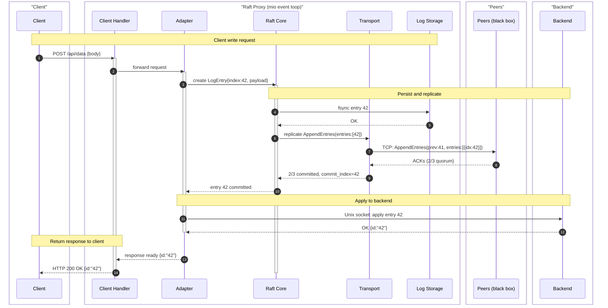

# Raft Proxy - Write Sequence (Detailed)

```mermaid
sequenceDiagram
    autonumber

    box "Client"
        participant C as Client
    end

    box "Raft Proxy (mio event loop)"
        participant CH as Client Handler
        participant AD as Adapter
        participant RC as Raft Core
        participant TS as Transport
        participant LS as Log Storage
    end

    box "Peers"
        participant P as Peers (black box)
    end

    box "Backend"
        participant BE as Backend
    end

    Note over C,LS: Client write request

    C->>CH: POST /api/data {body}
    activate CH
    CH->>AD: forward request
    activate AD
    AD->>RC: create LogEntry{index:42, payload}
    activate RC

    Note over RC,BE: Persist and replicate

    RC->>LS: fsync entry 42
    LS-->>RC: OK

    RC->>TS: replicate AppendEntries(entries:[42])
    TS->>P: TCP: AppendEntries(prev:41, entries:[{idx:42}])
    P-->>TS: ACKs (2/3 quorum)
    TS-->>RC: 2/3 committed, commit_index=42
    RC-->>AD: entry 42 committed

    Note over AD,BE: Apply to backend

    AD->>BE: Unix socket: apply entry 42
    BE-->>AD: OK {id:"42"}
    deactivate AD

    Note over C,CH: Return response to client

    AD-->>CH: response ready {id:"42"}
    CH-->>C: HTTP 200 OK {id:"42"}
    deactivate CH
    deactivate RC
```
