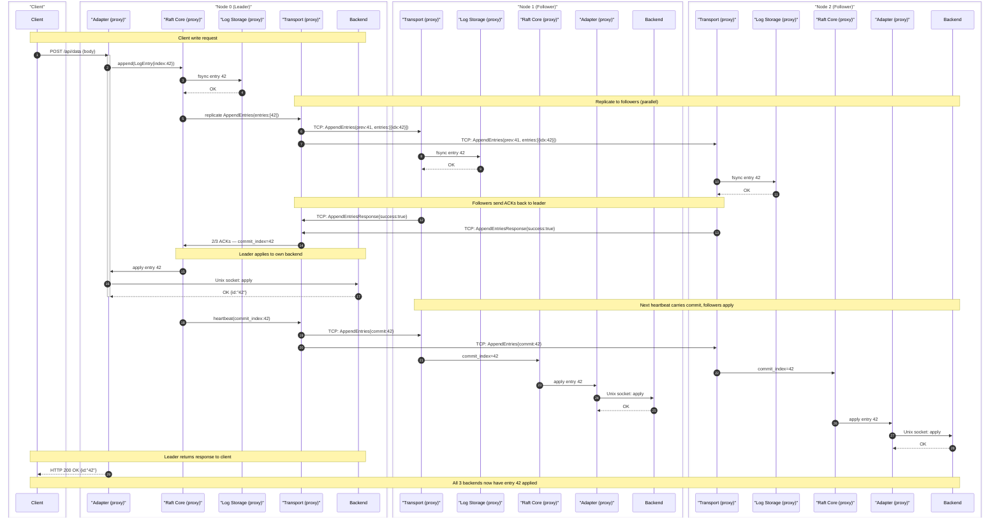

# Raft Proxy - Write Sequence

```mermaid
sequenceDiagram
    autonumber

    box "Client"
        participant C as Client
    end

    box "Node 0 (Leader)"
        participant AD0 as "Adapter (proxy)"
        participant RC0 as "Raft Core (proxy)"
        participant LS0 as "Log Storage (proxy)"
        participant TL0 as "Transport (proxy)"
        participant BE0 as Backend
    end

    box "Node 1 (Follower)"
        participant TL1 as "Transport (proxy)"
        participant LS1 as "Log Storage (proxy)"
        participant RC1 as "Raft Core (proxy)"
        participant AD1 as "Adapter (proxy)"
        participant BE1 as Backend
    end

    box "Node 2 (Follower)"
        participant TL2 as "Transport (proxy)"
        participant LS2 as "Log Storage (proxy)"
        participant RC2 as "Raft Core (proxy)"
        participant AD2 as "Adapter (proxy)"
        participant BE2 as Backend
    end

    Note over C,BE0: Client write request

    C->>AD0: POST /api/data {body}
    activate AD0
    AD0->>RC0: append(LogEntry{index:42})
    RC0->>LS0: fsync entry 42
    LS0-->>RC0: OK

    Note over TL0,BE2: Replicate to followers (parallel)

    RC0->>TL0: replicate AppendEntries(entries:[42])
    TL0->>TL1: TCP: AppendEntries(prev:41, entries:[{idx:42}])
    TL0->>TL2: TCP: AppendEntries(prev:41, entries:[{idx:42}])

    TL1->>LS1: fsync entry 42
    LS1-->>TL1: OK
    TL2->>LS2: fsync entry 42
    LS2-->>TL2: OK

    Note over TL0,TL2: Followers send ACKs back to leader

    TL1->>TL0: TCP: AppendEntriesResponse{success:true}
    TL2->>TL0: TCP: AppendEntriesResponse{success:true}
    TL0->>RC0: 2/3 ACKs — commit_index=42

    Note over RC0,BE0: Leader applies to own backend

    RC0->>AD0: apply entry 42
    AD0->>BE0: Unix socket: apply
    BE0-->>AD0: OK {id:"42"}
    deactivate AD0

    Note over TL1,BE2: Next heartbeat carries commit, followers apply

    RC0->>TL0: heartbeat(commit_index:42)
    TL0->>TL1: TCP: AppendEntries{commit:42}
    TL0->>TL2: TCP: AppendEntries{commit:42}

    TL1->>RC1: commit_index=42
    TL2->>RC2: commit_index=42

    RC1->>AD1: apply entry 42
    AD1->>BE1: Unix socket: apply
    BE1-->>AD1: OK

    RC2->>AD2: apply entry 42
    AD2->>BE2: Unix socket: apply
    BE2-->>AD2: OK

    Note over C,BE0: Leader returns response to client

    AD0-->>C: HTTP 200 OK {id:"42"}

    Note over C,BE2: All 3 backends now have entry 42 applied
```
