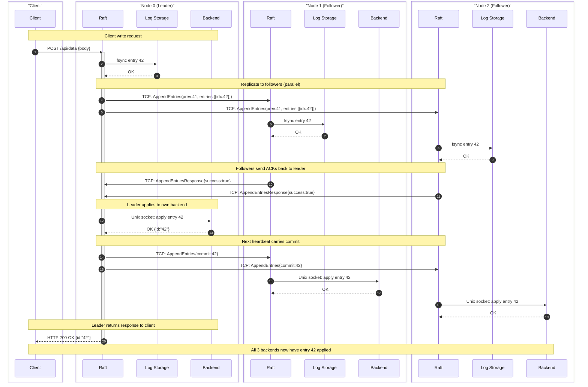

# Raft Proxy - Write Sequence

```mermaid
sequenceDiagram
    autonumber

    box "Client"
        participant C as Client
    end

    box "Node 0 (Leader)"
        participant R0 as Raft
        participant L0 as Log Storage
        participant BE0 as Backend
    end

    box "Node 1 (Follower)"
        participant R1 as Raft
        participant L1 as Log Storage
        participant BE1 as Backend
    end

    box "Node 2 (Follower)"
        participant R2 as Raft
        participant L2 as Log Storage
        participant BE2 as Backend
    end

    Note over C,BE0: Client write request

    C->>R0: POST /api/data {body}
    activate R0
    R0->>L0: fsync entry 42
    L0-->>R0: OK

    Note over R0,R2: Replicate to followers (parallel)

    R0->>R1: TCP: AppendEntries(prev:41, entries:[{idx:42}])
    R0->>R2: TCP: AppendEntries(prev:41, entries:[{idx:42}])

    R1->>L1: fsync entry 42
    L1-->>R1: OK
    R2->>L2: fsync entry 42
    L2-->>R2: OK

    Note over R0,R2: Followers send ACKs back to leader

    R1->>R0: TCP: AppendEntriesResponse{success:true}
    R2->>R0: TCP: AppendEntriesResponse{success:true}

    Note over R0,BE0: Leader applies to own backend

    R0->>BE0: Unix socket: apply entry 42
    BE0-->>R0: OK {id:"42"}

    Note over R0,R2: Next heartbeat carries commit

    R0->>R1: TCP: AppendEntries{commit:42}
    R0->>R2: TCP: AppendEntries{commit:42}

    R1->>BE1: Unix socket: apply entry 42
    BE1-->>R1: OK
    R2->>BE2: Unix socket: apply entry 42
    BE2-->>R2: OK

    Note over C,BE0: Leader returns response to client

    R0-->>C: HTTP 200 OK {id:"42"}
    deactivate R0

    Note over C,BE2: All 3 backends now have entry 42 applied
```
